Recently my college app was updated with "minor UI improvements", and it was the most slop-coded user interface I have seen.

The old UI was clunky, but I would've preferred that over the slop cannon their AI agent produced.

# What Is Slop?

Slop UI is the UI that AI cooks up that looks off, where it's not supposed to be, doesn't serve a purpose or when a UI is too generic.

This is seen in vibe-coded UI without a vision. Vibe-coded UI can look great when done right, but most don't. And it makes the apps look cheap and unappealing to use.

# Examples of Slop-Coded Websites:

Cloudflare recently slop-coded a website.

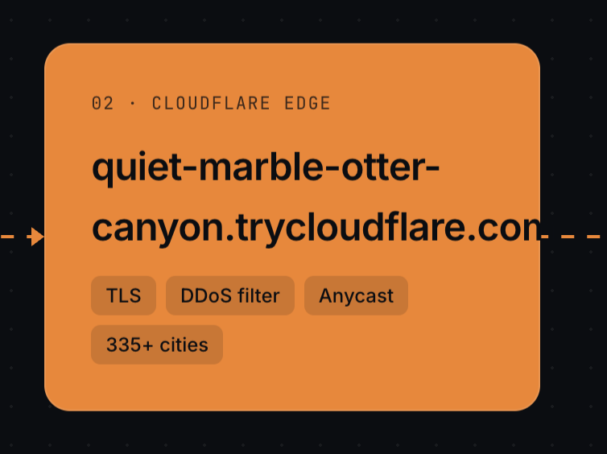

And also websites like this, you just know it when you see it. It's like the AI videos these days:

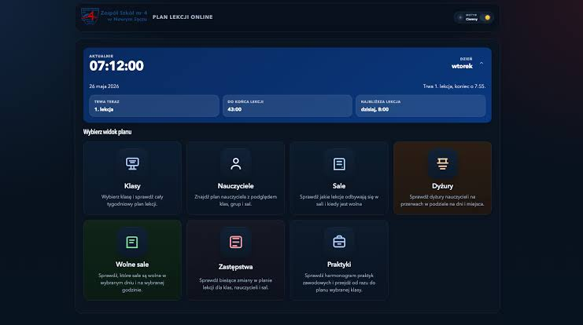

anyhow. The following are the things that make up the slop.

## Gradients. Gradients Everywhere.

The biggest and most noticeable sign is gradients. Gradients anywhere, gradients any time, gradients at every single thing. You'll see them on buttons, in the background, basically anywhere where it could stuff it.

**Slop Cannons LOVE purple for some reason**

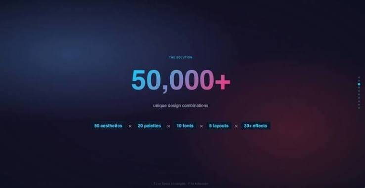

## Rainbow Vomit.

AI loves using colours that mean nothing and are just different colours.

You just get this, just a screen of a bunch of colours that don't go well together but are coloured that way. Because there is some distinction in fields when making the UI or whatever.

It doesn't follow the 70-30-10 rule. It just adds colours all over the place.

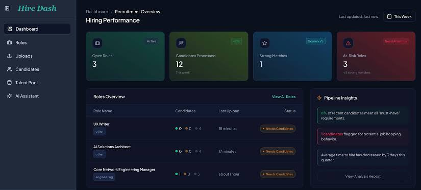

## Pulsing Badges

I have no clue why it adds these, but it just does. It is in the training data, I guess. But it adds these pulsing badges on everything.

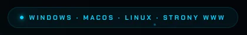

In the """upgrade""" my college app had. They have this thing called a digital ID, which just shows, like, a QR code and your face. It has this pulsing badge which says it's "active".

The problem is. IT IS JUST NEVER INACTIVE. IF IT IS INACTIVE, THE APP JUST LOGS YOU OUT. It's just redundant information.

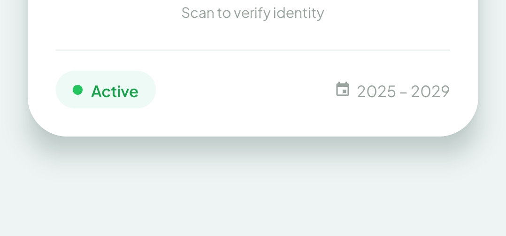

And my profile has an "active student" badge.

CAN SOMEONE TELL ME WHAT AN INACTIVE STUDENT LOOKS LIKE??

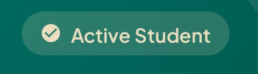

Also in the same digital ID interface. It added a little "verified" badge next to my college logo.

WHY THO.

Because it's not like it's doing some api call and going, "oh yeah, this guy is verified".

And EVEN IF IT WAS, IT DOESN'T MEAN ANYTHING, like. If I were forging my digital ID, would I deliberately add "unverified"????

## Finger Nail Cards.

I see these things in literally every vibecoded ui and it pisses me off every time.

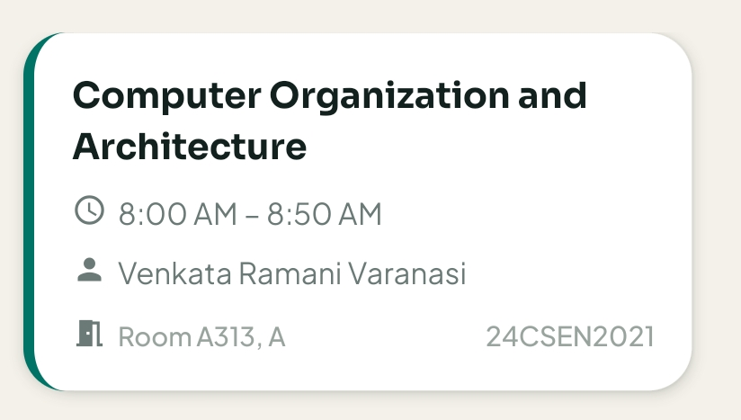

You see these everywhere, dude.

It's not even that it's bad; it's just so overused by literally every LLM in every single place that it just looks bad now.

The thing is. I don't think anyone has EVER consciously sat down and thought, "you know what would improve this? a fingernail"

## Emoji Slop

AI LOVES emojis for whatever reason. It loves them more than Sam Altman loves to pretend that they are pacing the frontier.

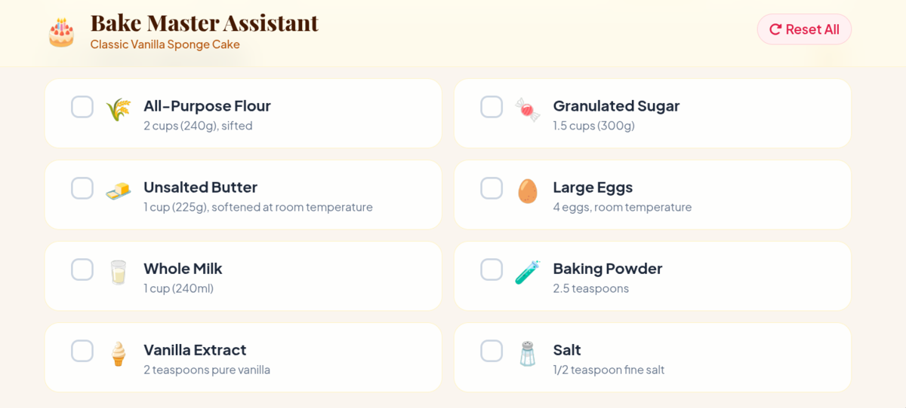

## Misaligned Stuff.

If you have SVGs or ASCII art or some kind of element that isn't in a box, it is almost always off its alignment.

Like this list in the timetable of my college app.

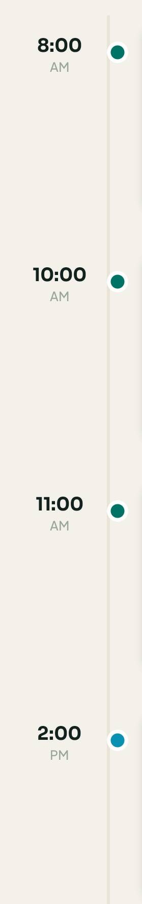

## Font Selection

These websites don't usually go for more interesting font selections. It's usually Inter, or if you have a website even remotely programming-related, you get JetBrains Mono.

and this thing:

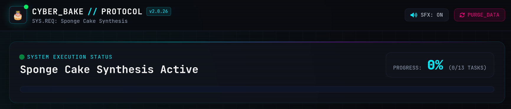

It adds these ``//`` whenever anything close to tech is mentioned.

## Redundant Text Due To Chat Context.

It just adds a bunch of redundant text just because of the chat context. For example. I was making my previous blogging website, and I told it, "Okay, I don't wanna be writing any HTML; I will write in my comfy Neovim, and I don't wanna do any web-related stuff."

It added text saying "Built with Hugo. Written from Neovim"

No, because no one gives a shit where I write it from. AI does this thing in readmes as well. It goes "Built with Modern CPP 20 features" BRO WHO CARES.

My college app has this on its startup screen.

The thing with this is. YOU CAN PRACTICALLY SMELL THE PROMPT THAT TRIGGERED THIS FROM THIS ONE.

Like "one campus. one app." Yup. Most definitely some management guy said, "let's unify our 3 apps; we have 3 apps for our 3 branches."

## Glassmorphism

It just loves glassmorphism. It doesn't go for any other design language(except brutalism, and for brutalism all of them look the EXACT same).

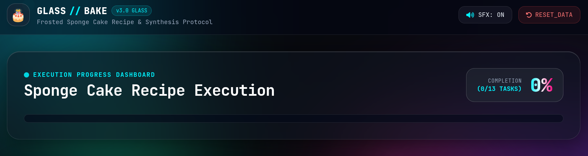

and this is the "brutalist aesthetic":

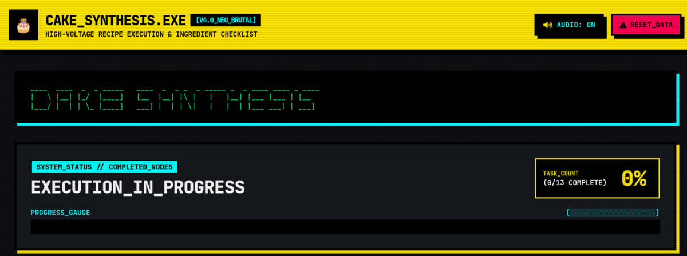

Now I gotta admit I can let the brutalist slide. It looks kinda cool till it gets overused and then you start hating it.

## Generic Taglines And Unnecessary Hype

It is obsessed with the words "Elevate", "Seamless", "Next-Generation", "Supercharge",

"Unleash", and "Empower".

Every H1 is followed by a greyish subtitle that says something like: "Experience the power of

task management with our cutting-edge intuitive interface."

It loves using "Welcome to your Dashboard, [Name] ✨" or "Revolutionise your workflow". It

treats every screen like a landing page rather than a functional tool.

# Conclusion

Honestly, this was just a bunch of things that annoy me when I look at slop. And it's not even that I am against vibecoding. This website is vibe coded; it looks cute tho. It's just that these people don't put ANY effort into making it even look mildly good.

